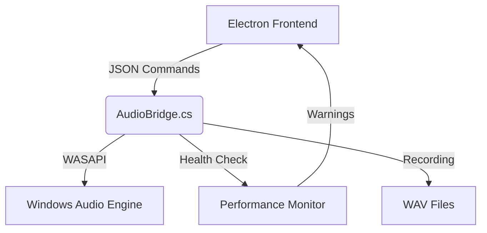

# Roadmap - VolumeFlow Evolution

Status projektu: **v1.9.0 Stable** (Advanced Settings & Mini-Player)

## 🎯 Co już zrobiliśmy
| Wersja | Kamień milowy | Status | Kluczowe cechy |
| :--- | :--- | :--- | :--- |
| v1.5.0 | Podstawa silnika | ✅ | WASAPI Integration, Peak Meters, Basic Mixer |
| v1.6.0 | Power Features | ✅ | Smart Overdrive, Per-process Recording, Auto-Ducking |
| v1.7.0 | UX & Stability | ✅ | OSD, Search, Health Monitoring, AudioBridge V1.8.0 |
| v1.8.1 | Global Control | ✅ | Global Hotkeys, Keybind Editor, config persistence |
| v1.9.0 | Pro Tools | ✅ | Mini-Player Mode, Advanced Audio Settings (Threshold/Factor/Fade) |

## 🚀 W trakcie realizacji (v2.0.0)
- [ ] **Audio Profiles**: Zapisywanie i wczytywanie zestawów głośności dla różnych scenariuszy (Gaming, Work, Movie).
- [ ] **FFT Visualization**: Wizualizacja pasma dźwięku (Spectrum Analyzer) dla każdego procesu.

## 🔮 Plany na przyszłość
- [ ] **v1.9.0**: Mini-Player Mode - kompaktowy widok z 3 najważniejszymi suwakami przypięty do rogu ekranu.
- [ ] **v2.0.0**: Audio Profiles - zapisywanie i wczytywanie zestawów głośności dla różnych scenariuszy (Gaming, Work, Movie).
- [ ] **Remote Control**: Aplikacja mobilna do sterowania głośnością komputera przez Wi-Fi.

---

## 📈 Ewolucja Architektury

## 🛠 Cele Techniczne (Technical Debt & R&D)
- [ ] Przejście na `Rust` dla mostka audio w wersji v2.1.0 dla jeszcze mniejszego narzutu CPU.
- [ ] Implementacja wizualizacji FFT (Spectrum Analyzer) dla każdego procesu.
