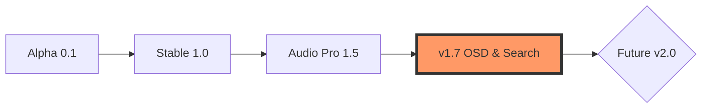

# 🗺️ VolumeFlow Roadmap

Witaj w mapie drogowej projektu **VolumeFlow**. Tutaj śledzimy naszą podróż od prostego miksera do zaawansowanego centrum kontroli dźwięku w Windows.

---

## 🚀 Status Projektu: **v1.7.0 Stable**
> [!TIP]
> Każda nowa funkcja przechodzi rygorystyczne testy wydajnościowe, aby VolumeFlow pozostał najlżejszym mikserem audio klasy premium.

---

## ✅ Co już zrobiliśmy (Milestones)

### 💎 Phase 1: Foundation & Core (v1.0 - v1.4)
- [x] **Native Audio Engine**: Przejście z CLI na natywny mostek C# (WASAPI).
- [x] **Premium UI**: 5 unikalnych motywów (Midnight, Solar, Matrix, Frost, Cyberpunk).
- [x] **Tray Integration**: Praca w tle i minimalizacja do zasobnika systemowego.
- [x] **Scene System**: Możliwość zapisywania i błyskawicznego przywracania profili głośności.
- [x] **Eye Saver**: Zintegrowany filtr światła niebieskiego dla nocnych sesji.
- [x] **App Icons**: Dynamiczne wyciąganie ikon bezpośrednio z procesów systemowych.

### ⚡ Phase 2: Power User Features (v1.5 - v1.7)
- [x] **Per-App Recording**: Nagrywanie dźwięku z konkretnych aplikacji do plików WAV (WASAPI Loopback).
- [x] **Smart Overdrive (Boost)**: Bezpieczne wzmocnienie Mastera bez cyfrowych przesterowań.
- [x] **Visual Peaks**: Prawdziwa wizualizacja natężenia dźwięku na każdym suwaku.
- [x] **Auto-Ducking**: Automatyczne przyciszanie tła, gdy wykryty zostanie dźwięk w wybranej aplikacji.
- [x] **UI/UX Optimization**: Nowa, wydajna nakładka Eye Saver i pełna obsługa Drag&Drop okna.
- [x] **Search & Filter**: Błyskawiczne wyszukiwanie aplikacji na liście.
- [x] **OSD Notifications**: Graficzne powiadomienia o zmianie profilu i statusie nagrywania.

---

## 🛠️ W trakcie realizacji (v1.8)

| Funkcja | Opis | Status |
| :--- | :--- | :---: |
| **Global Hotkeys** | Skróty klawiszowe do przełączania scen i nagrywania | 🏗️ Budowa |
| **Mini-Player Mode** | Jeszcze mniejszy tryb interfejsu (tylko 3 najważniejsze suwaki) | 📝 Planowanie |

---

## 🔮 Przyszłość (v2.0+)

- [ ] **EQ for Apps**: Niezależny korektor graficzny dla każdej aplikacji.
- [ ] **VST Plugin Support**: Możliwość nakładania efektów (np. kompresor na mikrofon) przez mikser.
- [ ] **Remote Control**: Sterowanie głośnością z poziomu smartfona (Web UI).
- [ ] **Virtual Cables**: Tworzenie wirtualnych urządzeń wyjściowych do streamingu.

---

## 📈 Ewolucja Projektu

---
*Ostatnia aktualizacja: 2026-05-11 (v1.7.0)*
